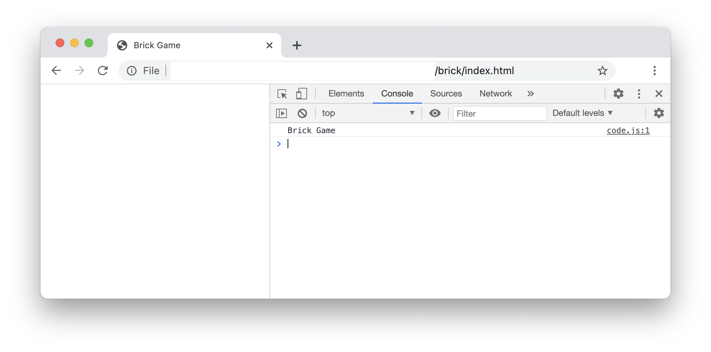
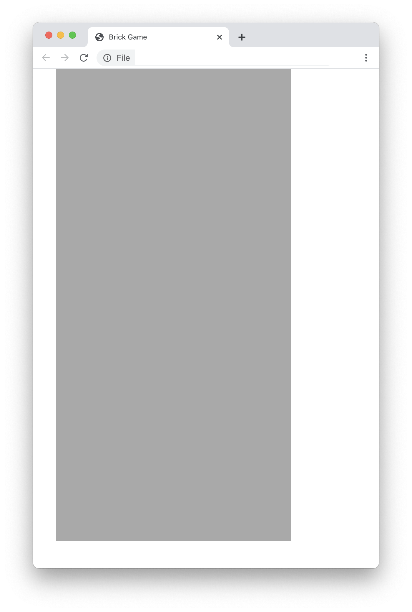

## Mục tiêu
- Tạo game Brick
- Do hầu hết các ngôn ngữ lập trình đều xoay quanh các khái niệm chính `for`, `function`, `array` nên nếu nắm được các khái niệm này thì coi như học được 50% ngôn ngữ.
- Qua việc tạo game Brick, bạn sẽ có cơ hội áp dụng toàn bộ những khái niệm trên một cách thành thạo.


## Các khái niệm

### Array
- [Tra cứu về Array](https://www.w3schools.com/jsref/jsref_obj_array.asp)
- `Array` (mảng) Array, hay còn gọi là mảng, là kiểu dữ liệu dạng chuỗi các phần tử (`element`). Trong đó mỗi `element` có thể có các kiểu dữ liệu hoặc giá trị khác nhau.
- Ví dụ: let a = [10, 2, 3, 4, "năm", "sáu", 7]
- Các chức năng của `Array`:
    + lấy số lượng phần tử: `a.length` (trả về 7)
    + lấy giá trị phần tử thứ i: (i từ 0 đến `length`):
        * a[3] trả về 4
        * a[0] trả về 10
        * a[5] trả về "sáu"
    + thêm 1 phần tử vào cuối: a.push(8)
    + thêm 1 phần tử vào đầu: a.unshift(0)
    + lấy ra 1 phần tử ở cuối: let x = a.pop()
    + lấy ra 1 phần tử ở đầu: let x = a.shift();
    + các chức năng khác: `concat`, `join`,...

### Bootstrap
- Bootstrap là CSS framework để thiết kế trang web bằng CSS3 dễ dàng hơn.
- Chỉ bằng cách điều chỉnh class của HTML element bằng các tên class dễ nhớ, có thể dễ dàng tạo được trang web HTLM đẹp.


## Tạo game
**Các bước tiến hành**
- Chuẩn bị folder dự án
- Tạo khung sườn chương trình
- Tạo Wall.

### Chuẩn bị folder dự án
- Tạo folder `brick`

### Tạo khung sườn HTML
Vào https://getbootstrap.com/docs/4.5/getting-started/introduction/#starter-template để lấy template mẫu.

Copy template mẫu vào folder `brick` vừa tạo ở trên. Sửa tag title thành `Brick Game`. Xóa dòng chứa `Hello, world!`
```html
<!doctype html>
<html lang="en">
<head>
    <!-- Required meta tags -->
    <meta charset="utf-8">
    <meta name="viewport" content="width=device-width, initial-scale=1, shrink-to-fit=no">

    <!-- Bootstrap CSS -->
    <link rel="stylesheet" href="https://cdn.jsdelivr.net/npm/bootstrap@4.5.3/dist/css/bootstrap.min.css" integrity="sha384-TX8t27EcRE3e/ihU7zmQxVncDAy5uIKz4rEkgIXeMed4M0jlfIDPvg6uqKI2xXr2" crossorigin="anonymous">

    <title>Brick Game</title>
</head>
<body>
<!-- Optional JavaScript; choose one of the two! -->

<!-- Option 1: jQuery and Bootstrap Bundle (includes Popper) -->
<script src="https://code.jquery.com/jquery-3.5.1.slim.min.js" integrity="sha384-DfXdz2htPH0lsSSs5nCTpuj/zy4C+OGpamoFVy38MVBnE+IbbVYUew+OrCXaRkfj" crossorigin="anonymous"></script>
<script src="https://cdn.jsdelivr.net/npm/bootstrap@4.5.3/dist/js/bootstrap.bundle.min.js" integrity="sha384-ho+j7jyWK8fNQe+A12Hb8AhRq26LrZ/JpcUGGOn+Y7RsweNrtN/tE3MoK7ZeZDyx" crossorigin="anonymous"></script>

<!-- Option 2: jQuery, Popper.js, and Bootstrap JS
<script src="https://code.jquery.com/jquery-3.5.1.slim.min.js" integrity="sha384-DfXdz2htPH0lsSSs5nCTpuj/zy4C+OGpamoFVy38MVBnE+IbbVYUew+OrCXaRkfj" crossorigin="anonymous"></script>
<script src="https://cdn.jsdelivr.net/npm/popper.js@1.16.1/dist/umd/popper.min.js" integrity="sha384-9/reFTGAW83EW2RDu2S0VKaIzap3H66lZH81PoYlFhbGU+6BZp6G7niu735Sk7lN" crossorigin="anonymous"></script>
<script src="https://cdn.jsdelivr.net/npm/bootstrap@4.5.3/dist/js/bootstrap.min.js" integrity="sha384-w1Q4orYjBQndcko6MimVbzY0tgp4pWB4lZ7lr30WKz0vr/aWKhXdBNmNb5D92v7s" crossorigin="anonymous"></script>
-->
</body>
</html>
```  

Tạo file `code.js` trong folder `brick` có nội dung như sau:

```js
// code.js
    console.log("Brick Game")
```
Thêm đoạn sau vào cuối file `index.html` để có thể sử dụng file `code.js`
```html
<!-- Đoạn cần thêm - vvv -->
    <script src="./code.js"></script>
<!-- Đoạn cần thêm - ^^^ -->

  </body>
</html>
```

Tạo file `brick.css` trong folder `brick` có nội dung như sau:

```css
#wall {
    background-color: darkgray;
    width: 400px;
    height: 800px;
}
```
Thêm đoạn sau vào đầu file `index.html` để có thể sử dụng file `brick.css`
```html
<!-- Đoạn cần thêm - vvv -->
    <link rel="stylesheet" href="brick.css">
<!-- Đoạn cần thêm - ^^^ -->

</head>
<body>
```


Mở file `index.html` trên Browser. Mở console xem kết quả.



**Giải thích**
- File index.html có sẵn các dòng khai báo bootstrap từ CDN. Ta có thể sử dụng luôn mà không cần copy thư viện này về local.
- Chi tiết về bootstrap sẽ được giới thiệu ở tài liệu [Tra cứu Bootstrap](https://getbootstrap.com/docs/4.5/getting-started/introduction/).


### Tạo Wall
Phiên bản đầu tiên ta tạo Wall kích thước 10 ngang 20 dọc. Kích thước mỗi ô là 40x40 pixel.

Thêm dòng sau vào file `index.html`

```html
    <script src="./code.js"></script>

<!-- Đoạn cần thêm - vvv -->
    <div class="container">
        <div id="wall" class="position-relative"></div>
    </div>
<!-- Đoạn cần thêm - ^^^ -->
  </body>
</html>
```

**Giải thích** ở đây ta tạo 1 `div` container chứa toàn bộ nội dung game: `Wall`, `Brick`...
Bên trong, chứa `div` có `id` #wall đại diện cho hình bức tường trong game. Do được định nghĩa css trong file `brick.css` nên wall sẽ có các thuộc tính sau:
- `width` (ngang) 40x10=400 (pixel)
- `height` (dọc) 40x20 = 800 (pixel)
- `background-color` (màu nền) darkgray.
```css
#wall {
    background-color: darkgray;
    width: 400px;
    height: 800px;
}
```
- Chú ý: `#wall` có class name `position-relative` được định nghĩa trong Bootstrap là kiểu `position: relative` mục đích để vẽ các cell bên trong wall có tọa độ gốc là (0, 0) so với góc trái trên của `#wall`.




Sửa file `brick.css`
```css
#wall {
	background-color: darkgray;	
	width: 400px; 
	height: 800px;
}

.cell {
	background-color: darkgray;
	border: 1px solid black;
	width: 40px;
	height: 40px;
}

.brick {
	background-color: yellow;
}

```

Sửa file `code.js`

```js
// code.js
const SIZE = 40;
const WIDTH = 10;
const HEIGHT = 20;

const aWall = [];

function initWall() {
	for(let y=0; y<HEIGHT; y++) {
		aWall.push(new Array(WIDTH).fill(0));
	}

	for(let y=0; y<HEIGHT; y++) {
		for(let x=0; x<WIDTH; x++) {
			if(Math.random() < 0.5) {
				aWall[y][x] = 1;
			}
		}
	}

	
	let wall = document.getElementById("wall");
	let emptyCSS = "position-absolute cell";
	let brickCSS = "position-absolute cell brick";

	for(let y=0; y<HEIGHT; y++) {
		for(let x=0; x<WIDTH; x++) {
			var cell = document.createElement("div");                 // Create a <div> node
			cell.id = `c-${y}-${x}`;
			cell.className = aWall[y][x] == 0? emptyCSS : brickCSS;
			cell.style.top = `${y * SIZE}px`;
			cell.style.left = `${x * SIZE}px`;
			wall.appendChild(cell);
		}
	}


}
function main() {
	initWall();
}

window.addEventListener('DOMContentLoaded', main);

```

**Giải thích**
- `SIZE` là kích thước theo pixel của mỗi ô gạch (40 pixel).
- `WIDTH`, `HEIGHT` là chiều rộng, cao của tường.
- `aWall` là mảng 2 chiều chứa loại gạch. Giá trị phần tử `aWall[y][x]` cho biết chỗ đó đã được lấp đầy hay chưa.
    + 0 nghĩa là chưa được xếp gạch, sẽ có màu là `WALL_COLOR`
    + 1 nghĩa là đã được xếp gạch, sẽ có màu là `CELL_COLOR`
- Dòng sau có nghĩa là khi browser dựng xong khung HTML thì sẽ gọi function `main`.
```js
    $(document).ready(main);
```
